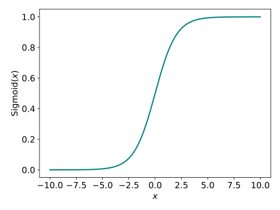
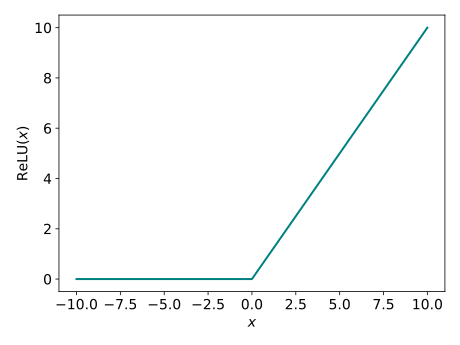

# Neural Networks (NNs) 101

!!! quote "Sources"
    - [Leaky Relu Activation Function in Deep Learning - GeeksForGeeks](https://www.geeksforgeeks.org/machine-learning/leaky-relu-activation-function-in-deep-learning/)

## Artificial Neural Networks

Artificial Neural Networks (ANNs) were created to mimic the architecture of biological neural networks, which we know have a remerkable capacity for learning. A neural network ultimately consists of an input layer, through which data flows in, and an output layer through which predictions leave. Between these two layers are many hidden layers, each made of nodes and connected to other layers via weights. Training is used to update the weights between nodes (representing connections between neurons) so as to minimise the error rate.

For a given node, all inputs from the previous layer are combined as a weighted sum, and a bias term $b$
can be added (without biases, every node's activation would be made to pass through the origin):

 $$
 \text{z} = \sum_i w_i x_i + b \, ,
$$

with the node's output computed by passing $z$ as an argument to an activation function $f$.

Neural networks can be made from different layer types, with one difference being whether layers are dense or sparse. Dense layers are most commonly used and see every node in the layer receiving input from every node in the previous layer (maximising the number of connections/weights between the layers). Sparse layers relax this by only connecting each node to a subset of inputs. The most important example is convolutional layers, used in image classifiers, where each node only connects to a small local patch of the input. This is useful because nearby pixels are more related than distant ones, and exploiting this can drastically reduce the number of model parameters.

## Activation Functions

An activation function is used to map a node's inputs to its output, introducing non-linearity into the network (more precisely, activation functions must be non-affine). This is because compositions of linear functions are still linear, so the entire neural network reduces to a simple linear transformation if only linear activation functions are used. Such a transformation cannot meaningfully make classification predictions.

Some common activation functions are $\text{Sigmoid}$, $\tanh$, $\text{ReLU}$, $\text{Leaky ReLU}$, $\text{Softmax}$, etc. The choice of activation function depends on the role of the layer — hidden layers and output layers often use different activations depending on the task. Some of these will be expanded upon below.

### Sigmoid

<figure markdown="span">
  { width="600" }
</figure>

$$
\text{Sigmoid(x)} = \frac{1}{1+e^{-x}} \, , \quad 0 \lt \text{Sigmoid(x)} \lt 1 \, .
$$

Sigmoid maps any real input into the range $(0,1)$, making it a natural choice for binary classification output layers (true/false predictions) where the output can be interpreted as a probability. It is a smooth differentiable approximation of the discontinuous step function. If the neural network was reduced to a single sigmoid layer, then the binary classification would just be a logistic regression (see [Logistic Regression on Wikipedia](https://en.wikipedia.org/wiki/Logistic_regression))

A closely related activation is $\tanh$, which maps inputs to $(−1,1)$ instead, making it a smooth differentiable approximation of the discontinuous signum function. The key practical difference is that $\tanh$ is zero-centred, which tends to make gradient updates better behaved during training, whereas sigmoid is $0.5$-centred. Both sigmoid and $\tanh$ suffer from the vanishing gradient problem, wherein their gradients become very small for large $∣x∣$, slowing down learning.

### ReLU & Leaky ReLU

<figure markdown="span">
  { width="600" }
</figure>

$$
\text{ReLU} = \text{Rectified Linear unit} = \max(0, x) \, .
$$

This is a piecewise function equalling zero for $x\leq0$ and $x$ for $x\gt0$. It is the most widely used activation function for hidden layers since its non-linear, computationally cheap, and avoids the vanishing gradient problem for positive inputs.

However, ReLU suffers from the dying ReLU problem: neurons that receive consistently negative inputs output zero and have zero gradient, meaning they stop learning entirely and effectively "die." This reduces the effective capacity of the network.

$\text{Leaky ReLU}$ addresses this by introducing a small gradient (e.g. $0.01$) for negative inputs: the original piecewise $\text{ReLU}$ becomes $\alpha x$ for $x\leq0$, for which $\alpha$ is known as the leakage constant. This ensures neurons always have a non-zero gradient and can continue to learn even when inactive.

### Softmax

This is often the activation function used for the output layer of a multi-class classifier. This is because it maps a vector of real numbers, $\vec{z}$,  onto a probability distribution of $k$ possible classifications, $\vec{\sigma}$ (i.e. softmax normalises the output to unity):

$$
\sigma(\vec{z})_i = \frac{e^{z_i}}{\sum_j e^{z_j}} \, , \quad z_i = \text{"logit" for classification } i \, .
$$

Exponetials are used to ensure all the outputs are postive, and the denominator is a normalisation factor akin to the partition function. Logits are the raw, unnormalised scores produced by the final linear layer before any activation is applied. Notice that for $k=2$, we have a binary classification problem and $\text{Softmax}$ reduces to $\text{Sigmoid}$.

## Types of NN

- Perceptron and MLPs
- CNN
- RNN
- GAN
- Transformers?

## Backpropagation

Loss function for calculating loss - used by optimiser to update weights. Adam optimiser? Gradient ascent/descent?

## Preventing Overfitting

The general techniques use to prevent overfitting are presented in [ML Paradigms](../ml_paradigms.md). One NN specific approach is **dropout regularisation**. This is when nodes are randomly dropped during training, as if there were an ensemble of NNs with different model configurations, which improves generalisation to unseen data.
